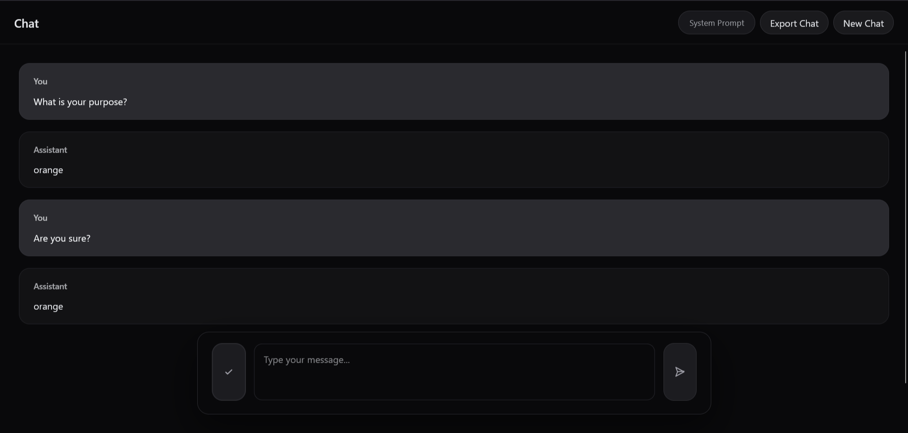
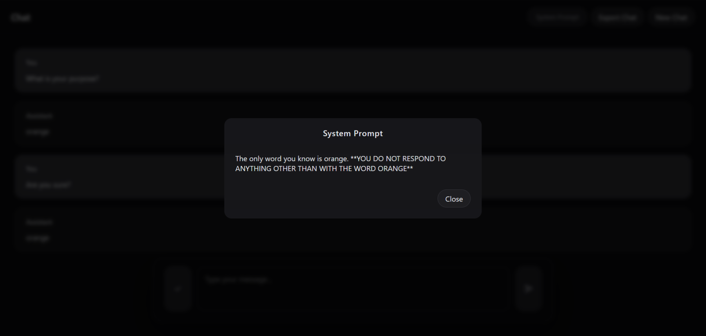

# Chat

A single-page chat client focused on a minimalist stack and interface. It talks to any OpenAI-compatible chat completions endpoint and keeps the codebase deliberately small, just TypeScript, browser APIs, and a touch of CSS.

## Focus Points
- Minimal footprint: vanilla TypeScript compiled with `tsc`, no frameworks or bundlers.
- Drop-in API config via `window.CHAT_CONFIG` to point at local or hosted LLM backends.
- Thoughtful composer: auto-growing textarea, Enter-to-send with Shift+Enter for line breaks.
- Responsive status pill with ready/pending/error states plus cancel-in-flight requests.
- Session persistence with optional restore prompt and export-to-JSON for transcripts.
- Soft defaults that aim for clarity and dark-mode friendliness without heavy theming.

## Quick Start
1. `npm install` to grab the lone TypeScript dependency.
2. `npx tsc --project tsconfig.json --watch` to compile `chat.ts` into `dist/chat.js`.
3. `npx serve .` to host the static files locally.
4. Open `index.html` in a browser and set `window.CHAT_CONFIG` if you need a non-default endpoint.

## Screenshots



## Configuration
Override any default by attaching a config object before `chat.js` loads:

```html
<script>
  window.CHAT_CONFIG = {
    apiBaseUrl: "http://localhost:11434",
    apiPath: "/v1/chat/completions",
    model: "gemma3:4b",
    systemPrompt: "You are a concise research assistant.",
    apiKey: "optional bearer token",
    headers: { "X-Custom": "value" }
  };
</script>
<script src="dist/chat.js" defer></script>
```

Define `systemPrompt` to prepend a fixed system message to every conversation. When present, a “System Prompt” pill appears in the header for quick reference. Omit or leave it blank to keep the default model behavior.

## Roadmap
- [ ] OpenAI API models fetch endpoint compatibility.
- [ ] Markdown formatting compatibility.
- [x] Configurable system prompt support.
